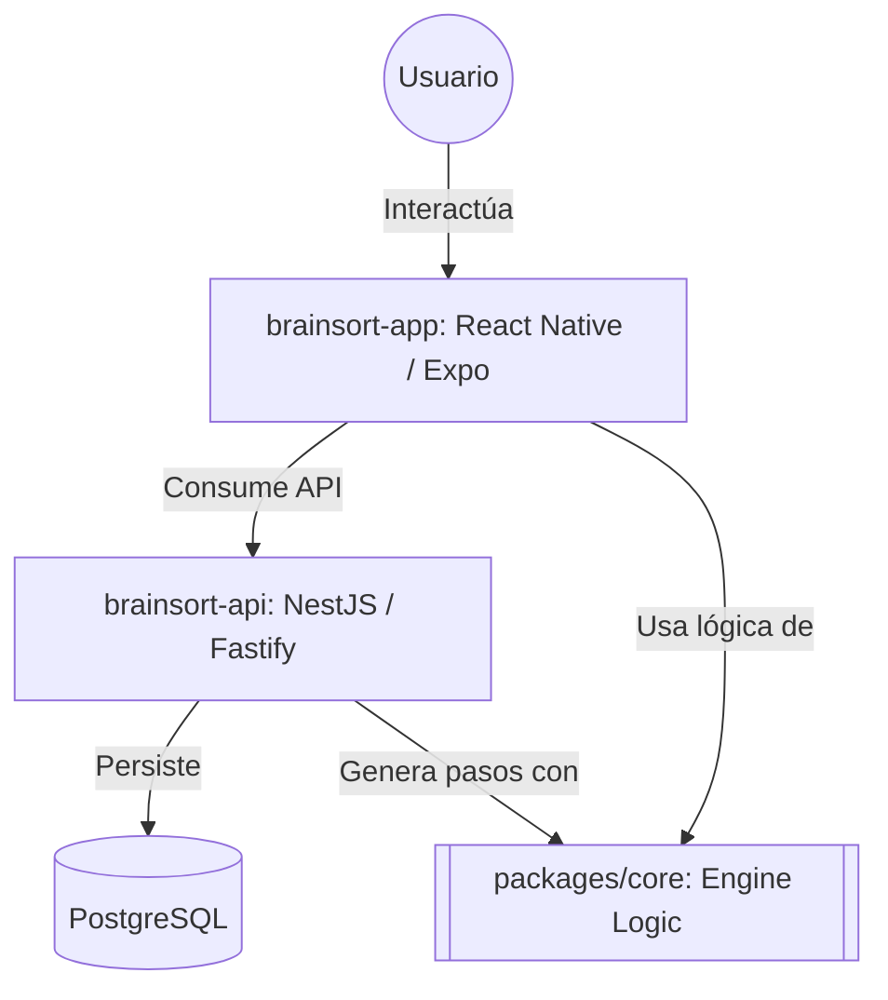

# Documentación de Especificaciones (SPECS) - BrainSort

Bienvenido al directorio de especificaciones de diseño y desarrollo (**SPEC Driven Development - GitHub Spec Kit Model**) para el proyecto BrainSort. 

Este directorio está diseñado para ser consumido tanto por desarrolladores humanos como por Agentes de IA, separando el "Qué construir" (Specs) del "Cómo construirlo" (Plans).

## 0. Arquitectura de Alto Nivel

A continuación se presenta un diagrama de contexto que muestra cómo interactúan las piezas fundamentales de BrainSort:

## 1. Archivos Fundacionales

| Archivo | Descripción |
|---|---|
| [`constitution.md`](./constitution.md) | Principios innegociables del proyecto (Stack, UI/UX, Reglas). Todo Agente IA debe leer esto primero. |
| [`UI_UX_ENHANCEMENT_SPEC.md`](./UI_UX_ENHANCEMENT_SPEC.md) | Dirección visual, sistema de diseño y reglas de componentes UX para la interfaz de BrainSort. |

## 2. Características (Features)

Las especificaciones están divididas en dominios funcionales dentro de la carpeta `features/`. Cada dominio cuenta con un archivo `.spec.md` (Requisitos), `.plan.md` (Arquitectura Técnica) y `.tasks.md` (Tareas de Implementación).

| Dominio Funcional | Archivos | Descripción |
|---|---|---|
| **Core & Domain** | [`core-domain.spec.md`](./features/core-domain.spec.md) [`core-domain.plan.md`](./features/core-domain.plan.md) [`core-domain.tasks.md`](./features/core-domain.tasks.md) | Visión General del Producto, Glosario y diagramas de base de datos del Modelo del Dominio en PostgreSQL. |
| **Architecture & Auth** | [`architecture-auth.spec.md`](./features/architecture-auth.spec.md) [`architecture-auth.plan.md`](./features/architecture-auth.plan.md) [`architecture-auth.tasks.md`](./features/architecture-auth.tasks.md) | Modelo C4 del software, requisitos de Autenticación, JWT y control de roles (RBAC). |
| **Biblioteca y Simulación** | [`library-simulation.spec.md`](./features/library-simulation.spec.md) [`library-simulation.plan.md`](./features/library-simulation.plan.md) [`library-simulation.tasks.md`](./features/library-simulation.tasks.md) | Algoritmos implementados (Bubble, Merge, etc.), motor visual paso a paso, y generador de datos. |
| **Gamificación y Ejercicios** | [`gamification-exercises.spec.md`](./features/gamification-exercises.spec.md) [`gamification-exercises.plan.md`](./features/gamification-exercises.plan.md) [`gamification-exercises.tasks.md`](./features/gamification-exercises.tasks.md) | Preguntas predictivas, mecánicas de puntos, niveles, tabla de posiciones e insignias de retención. |
| **Offline & Mobile** | [`offline-mobile.spec.md`](./features/offline-mobile.spec.md) [`offline-mobile.plan.md`](./features/offline-mobile.plan.md) [`offline-mobile.tasks.md`](./features/offline-mobile.tasks.md) | Capacidades offline, descarga selectiva de módulos, PWA, distribución iOS/Android via Expo. |
| **Sandbox / Mini Juez** | [`sandbox-code-runner.plan.md`](./features/sandbox-code-runner.plan.md) | Ejecución local de código Python (MicroPython WASM) y C++ (JSCPP) en WebView sandboxed. V1: prueba de concepto con ejercicios hardcoded. |
| **Testing & QA** | [`testing-qa.spec.md`](./features/testing-qa.spec.md) | Estrategia de pruebas (IEEE 829), niveles de prueba (unitarias/integración/E2E), criterios de aceptación, trazabilidad HU↔CP, riesgos. |

## 3. Plan de Implementación

La carpeta [`plan-de-implementacion/`](./plan-de-implementacion/) contiene el detalle técnico de **cómo** se implementará el proyecto en cada repositorio:

| Documento | Descripción |
|---|---|
| [`INDEX.md`](./plan-de-implementacion/INDEX.md) | Visión general, arquitectura de repos separados y orden de implementación. |
| [`01-backend-api.md`](./plan-de-implementacion/01-backend-api.md) | Estructura de `brainsort-api`: módulos NestJS, controladores, servicios, DTOs. |
| [`02-frontend-app.md`](./plan-de-implementacion/02-frontend-app.md) | Estructura de `brainsort-app`: pantallas, hooks, engine, visualización, offline. |
| [`03-base-de-datos.md`](./plan-de-implementacion/03-base-de-datos.md) | Esquema Prisma completo con mapeo Dominio → DB. |
| [`04-contratos-api.md`](./plan-de-implementacion/04-contratos-api.md) | Contrato REST entre frontend y backend: endpoints, DTOs, respuestas. |
| [`05-despliegue-devops.md`](./plan-de-implementacion/05-despliegue-devops.md) | Docker, CI/CD, Railway, Vercel, Expo EAS Build. |

## 4. Plantillas

Las siguientes plantillas se encuentran en `templates/` y dictan la estructura que deben seguir todas las nuevas características agregadas al proyecto:
- `spec-template.md` (Qué es la feature y requisitos)
- `plan-template.md` (Diseño técnico y de base de datos)
- `tasks-template.md` (Despiece de tareas a implementar)

## 5. Documentación de Pruebas

La carpeta [`pruebas/`](./pruebas/) contiene la línea base de documentación de pruebas del proyecto, alineada con el estándar IEEE 829-2008:

| Documento | Descripción |
|---|---|
| [`pruebas/README.md`](./pruebas/README.md) | Índice y estructura de la documentación de pruebas. |
| `3.1-Plan-de-Pruebas-BrainSort.docx` | Plan de pruebas de software: alcance, estrategia, cronograma, riesgos. |
| `3.2-Casos-de-Prueba-BrainSort.xlsx` | Diseño de casos de prueba: ID, módulo, precondiciones, pasos, resultado esperado/real. |
| `3.3-Informe-de-Prueba-BrainSort.xlsx` | Informe de ejecución: resumen, casos pasados/fallados, cobertura, defectos. |

**Generadores auxiliares** (carpeta `pruebas/scripts/`):
- `gen_ejemplo_plan.py` — Genera `.docx` del Plan de Pruebas con datos reales de BrainSort.
- `gen_ejemplo_casos.py` — Genera `.xlsx` con diseño de casos de prueba.
- `gen_ejemplo_informe.py` — Genera `.xlsx` con informe de resultados.
- `generate_brainsort_testing_docs.py` — Regenera los entregables finales 3.1, 3.2 y 3.3 y las copias de ejemplo.

**Ejemplos de referencia** (carpeta `pruebas/ejemplos/`):
- Templates pre-llenados con datos de ejemplo para consulta.

## 6. Manual de Uso

La carpeta [`MANUAL DE USO/`](./MANUAL%20DE%20USO/) contiene las guías de ejecución del proyecto:

| Documento | Descripción |
|---|---|
| [`01-Ejecutar-Backend.md`](./MANUAL%20DE%20USO/01-Ejecutar-Backend.md) | Instrucciones para levantar `brainsort-api` en desarrollo local. |
| [`02-Ejecutar-Frontend.md`](./MANUAL%20DE%20USO/02-Ejecutar-Frontend.md) | Instrucciones para levantar `brainsort-app` con Expo. |

---

> **Metodología:** Las especificaciones aquí documentadas son "Living Documents" (Documentos Vivos). Si una decisión de arquitectura o requerimiento de negocio cambia durante el ciclo de vida de BrainSort, los archivos `.plan.md` y `.spec.md` afectados deben actualizarse antes de escribir el código.
