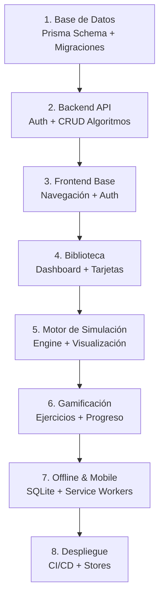

# Plan de Implementación — BrainSort

> **Fuente de verdad**: `BrainSort-Documento_Arquitectura_Software.docx`, `BrainSort-Modelo_del_Dominio.docx`

## Arquitectura de Repositorios Separados

BrainSort se construye sobre **dos repositorios independientes** que se comunican mediante API REST documentada con Swagger (OpenAPI):

```
┌─────────────────────────────────────────────────────────────────┐
│                     GitHub Organization                         │
│                  https://github.com/BrainSort                   │
│                                                                 │
│  ┌──────────────────────┐       ┌──────────────────────────┐   │
│  │   brainsort-app       │       │   brainsort-api           │   │
│  │   (Frontend)          │◄─────►│   (Backend)               │   │
│  │                       │ REST  │                           │   │
│  │ React Native + Expo   │ JSON  │ NestJS + Fastify          │   │
│  │ TypeScript             │       │ TypeScript                │   │
│  │ Web + Android + iOS   │       │ PostgreSQL + Prisma ORM   │   │
│  └──────────────────────┘       └──────────────────────────┘   │
└─────────────────────────────────────────────────────────────────┘
```

## Documentos de este Plan

| Archivo | Descripción |
|---|---|
| [`01-backend-api.md`](./01-backend-api.md) | Plan detallado de `brainsort-api`: módulos NestJS, controladores, servicios, DTOs y estructura de carpetas. |
| [`02-frontend-app.md`](./02-frontend-app.md) | Plan detallado de `brainsort-app`: pantallas, componentes, hooks, engine de algoritmos, visualización y navegación. |
| [`03-base-de-datos.md`](./03-base-de-datos.md) | Esquema Prisma completo: modelos, relaciones, migraciones y seeds basados en el Modelo del Dominio. |
| [`04-contratos-api.md`](./04-contratos-api.md) | Contrato completo de API REST entre frontend y backend: todos los endpoints, DTOs, respuestas y códigos de error. |
| [`05-despliegue-devops.md`](./05-despliegue-devops.md) | Pipeline CI/CD, Docker, ambientes (dev/staging/prod), y distribución móvil. |

## Orden de Implementación Recomendado



## Principio Clave: Contrato Swagger como Puente

La sincronización entre repos se garantiza mediante:
1. **Backend** genera el contrato Swagger automáticamente desde sus DTOs y decoradores.
2. **Frontend** genera interfaces TypeScript automáticamente desde el contrato con `openapi-typescript`.
3. **Cualquier cambio** en la API requiere actualizar el contrato → regenerar tipos en el frontend.
